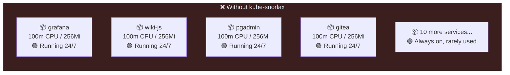
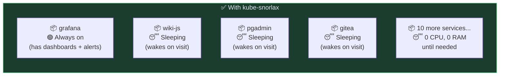
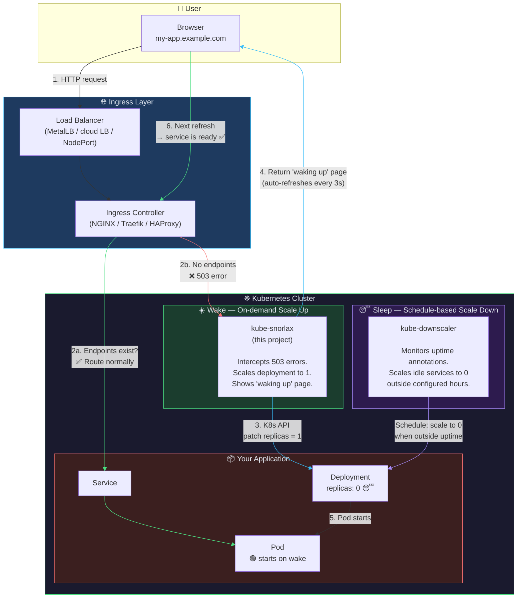

# kube-snorlax

> *Named after [Snorlax](https://pokemondb.net/pokedex/snorlax) — the Pokémon that sleeps all day and only wakes up to eat. Your services do the same, except they wake up when someone visits the URL.*

**Stop wasting resources on idle Kubernetes services. Sleep them. Wake them on demand.**

Most clusters run dozens of services 24/7, but only a fraction are in active use at any given time. The rest sit idle, burning CPU and memory that could be freed for workloads that matter — or not provisioned at all.

**kube-snorlax** brings scale-to-zero with wake-on-request to any Kubernetes cluster. Services sleep on a schedule. When someone visits the URL, they wake up instantly. No manual intervention, no lost access. Just fewer wasted resources.

> **Real-world savings**: A dev team cluster with 60 microservices sleeping 30 low-traffic services during off-hours (16h/day) reclaimed **~8 vCPUs and ~20 GB of RAM** — enough to drop a node from the cluster or defer a capacity upgrade.
>
> Even on a modest homelab (42 services, 25 GB total), sleeping 15 idle services freed ~2 vCPUs and ~5 GB — a 20% reduction in cluster resource usage.

## The Problem





## How It Works

The system has two parts: **sleeping** (scheduled scale-down) and **waking** (on-demand scale-up).



### Step by Step

| Step | What happens |
|------|-------------|
| **Sleep** | `kube-downscaler` sees the `downscaler/uptime` annotation on your deployment. Outside that window, it scales replicas to 0. Pod terminates. Resources freed. |
| **1** | Hours later, a user opens `my-app.example.com` in their browser. |
| **2** | The ingress controller tries to route to the backend — but there are no endpoints (0 replicas). It returns a **503**. |
| **3** | The `custom-http-errors: "503"` annotation tells the ingress to forward the 503 to **kube-snorlax** instead. |
| **4** | The waker receives the request with `X-Service-Name` header, calls the Kubernetes API to **patch replicas to 1**, and sets a `downscaler/last-wakeup` timestamp annotation. |
| **5** | The user sees a clean **"waking up..."** page with a spinner that auto-refreshes every 3 seconds. |
| **6** | Once the pod is ready (~15-60s), the next refresh routes through the ingress normally — the user lands on the real app. |
| **Grace** | kube-downscaler sees the `last-wakeup` annotation and respects a configurable grace period before considering the service idle again. |

## Which Services Should Sleep?

Not everything should be scaled to zero. Here's a practical guide:

| Category | Examples | Sleep? | Why |
|----------|---------|--------|-----|
| **Rarely accessed UIs** | pgAdmin, Headlamp, phpMyAdmin | ✅ Yes | Only open them occasionally for admin tasks |
| **Internal tools** | Wiki.js, Gitea, Filebrowser, Weblate | ✅ Yes | Used when you need them, idle the rest of the time |
| **Backup / maintenance UIs** | Kopia UI, Velero UI | ✅ Yes | Backup jobs run via CronJobs, UI is rarely needed |
| **Dev environments** | code-server, Jupyter, Coder | ✅ Yes | Spin up on demand, no need to run 24/7 |
| **Dashboards / analytics** | Grafana, Kibana, Redash | ❌ No | Often have alerting or scheduled reports |
| **CI/CD** | ArgoCD, Tekton, Drone | ❌ No | Need to react to git pushes and webhooks in real-time |
| **DNS / networking** | CoreDNS, Pi-hole, ExternalDNS | ❌ No | Everything depends on DNS being up |
| **Passwords / auth** | Vaultwarden, Keycloak | ❌ No | Browser extensions and SSO expect instant response |
| **Monitoring** | Prometheus, Grafana Loki, Alertmanager | ❌ No | Need continuous uptime tracking and alerting |
| **Infrastructure** | Ingress, MetalLB, cert-manager | ❌ No | Cluster depends on them |

## Quick Start

### Prerequisites

- Kubernetes cluster (v1.24+)
- NGINX Ingress Controller (or Traefik — see [Alternatives](#works-with))
- [kube-downscaler](https://codeberg.org/hjacobs/kube-downscaler) or any mechanism that scales deployments to 0

### 1. Install kube-snorlax

```bash
# Option A: Helm repo (hosted on GitHub Pages)
helm repo add kube-snorlax https://vineethvijay.github.io/kube-snorlax
helm repo update
helm install kube-snorlax kube-snorlax/kube-snorlax

# Option B: OCI (no repo add needed)
helm install kube-snorlax oci://ghcr.io/vineethvijay/charts/kube-snorlax --version 1.0.0

# Option C: From source
git clone https://github.com/vineethvijay/kube-snorlax.git
helm install kube-snorlax ./kube-snorlax/helm/kube-snorlax

# Option D: Your own image
docker build -t your-registry/kube-snorlax:latest .
docker push your-registry/kube-snorlax:latest
helm install kube-snorlax ./helm/kube-snorlax \
  --set image.repository=your-registry/kube-snorlax
```

### 2. Make a deployment sleepable

Add the `downscaler/uptime` annotation to tell kube-downscaler when the service should be running:

```yaml
apiVersion: apps/v1
kind: Deployment
metadata:
  name: my-app
  annotations:
    # Sleep outside 8 AM - 1 AM
    downscaler/uptime: "Mon-Sun 08:00-01:00 Europe/Stockholm"
spec:
  replicas: 1
  # ...
```

### 3. Enable wake-on-request on the ingress

Tell the ingress controller to forward 503 errors to the waker:

```yaml
apiVersion: networking.k8s.io/v1
kind: Ingress
metadata:
  name: my-app-ingress
  annotations:
    nginx.ingress.kubernetes.io/custom-http-errors: "503"
    nginx.ingress.kubernetes.io/default-backend: kube-snorlax
spec:
  rules:
    - host: my-app.example.com
      http:
        paths:
          - path: /
            pathType: Prefix
            backend:
              service:
                name: my-app
                port:
                  number: 80
```

### 4. (If using ArgoCD) Prevent sync conflicts

ArgoCD with `selfHeal: true` will fight external replica changes. Add `ignoreDifferences`:

```yaml
spec:
  ignoreDifferences:
    - group: apps
      kind: Deployment
      jsonPointers:
        - /spec/replicas
  syncPolicy:
    syncOptions:
      - RespectIgnoreDifferences=true
```

### 5. Test it

```bash
# Manually simulate a sleeping service
kubectl scale deployment my-app --replicas=0

# Visit the URL — you should see the "waking up" page
curl http://my-app.example.com

# After ~15-60 seconds, the service is back
curl http://my-app.example.com  # → normal response
```

## Works With

This project was built and tested on a bare-metal homelab, but the pattern works with any Kubernetes setup:

| Component | Tested With | Also Works With |
|-----------|------------|-----------------|
| **Ingress Controller** | NGINX Ingress | Traefik ([error pages middleware](https://doc.traefik.io/traefik/middlewares/http/errorpages/)), HAProxy, Caddy |
| **Load Balancer** | MetalLB (L2) | kube-vip, cloud LBs (AWS ALB/NLB, GCP LB), NodePort |
| **Downscaler** | [kube-downscaler](https://codeberg.org/hjacobs/kube-downscaler) | [KEDA](https://keda.sh/) (cron trigger), CronJobs with `kubectl scale`, manual scaling |
| **GitOps** | ArgoCD (with `ignoreDifferences`) | FluxCD, manual `helm install` |
| **Cluster** | Bare-metal (Proxmox VMs + Calico CNI) | EKS, GKE, AKS, k3s, kind, minikube |
| **DNS** | Pi-hole + local DNS | CoreDNS, ExternalDNS, cloud DNS |

> **Key requirement**: Your ingress controller must support forwarding error responses (503) to a custom backend with headers identifying the original service. NGINX Ingress does this natively via `custom-http-errors` + `default-backend` annotations.

## Configuration

### Environment Variables

| Variable | Default | Description |
|----------|---------|-------------|
| `TARGET_NAMESPACE` | `default` | Fallback namespace when `X-Namespace` header is not set |

### Helm Values

| Key | Default | Description |
|-----|---------|-------------|
| `image.repository` | `ghcr.io/vineethvijay/kube-snorlax` | Container image |
| `image.tag` | `latest` | Image tag |
| `replicaCount` | `1` | Waker replicas |
| `targetNamespace` | `default` | Default namespace for deployments |
| `resources.requests.cpu` | `25m` | CPU request |
| `resources.requests.memory` | `64Mi` | Memory request |
| `resources.limits.memory` | `256Mi` | Memory limit |

### RBAC

Minimal permissions — can only read and patch deployments:

- `apps/deployments`: `get`, `patch`
- `apps/deployments/scale`: `get`, `patch`

### Conventions

- **Deployment name = Service name** — the waker maps `X-Service-Name` → deployment name
- **Grace period** — the `downscaler/last-wakeup` annotation prevents kube-downscaler from immediately re-sleeping a just-woken service
- **Cooldown** — a 30-second in-memory cooldown prevents duplicate K8s API calls from concurrent browser requests

## The "Waking Up" Page

When a sleeping service is accessed, users see a clean, dark-themed loading page:

- **Waking** — animated spinner, service name, "waking up..." message, auto-refresh every 3s
- **Ready** — green indicator, instant redirect to the real app
- **Error** — red indicator, "try again" link

No browser extensions, no client-side dependencies. Works in any browser.

## Project Structure

```
kube-snorlax/
├── Dockerfile                          # Python 3.12-slim, gunicorn, non-root
├── requirements.txt                    # flask, gunicorn, kubernetes
├── app/
│   ├── main.py                         # Flask routes — handles NGINX 503 forwards
│   ├── waker.py                        # K8s API client — patches deployments
│   └── templates/
│       └── waking.html                 # Loading page with auto-refresh
└── helm/
    └── kube-snorlax/
        ├── Chart.yaml
        ├── values.yaml
        └── templates/
            └── app.yaml                # Deployment, Service, RBAC
```

## Limitations

- **Not transparent proxying** — the first request sees a "waking up" page (~15-60s) instead of being held open. This is a deliberate trade-off for simplicity and reliability over complexity (Knative/Osiris approach)
- **HTTP-only wake** — services accessed via direct LoadBalancer IPs (bypassing ingress) won't trigger the waker. Keep those always-on
- **Cold start time** depends on your app's image size and startup time

## Why Not Just Use...

| Alternative | Why kube-snorlax is simpler |
|-------------|-------------------------------------|
| **Knative Serving** | Full serverless platform. Requires Knative operator, Kourier/Istio, custom domains. Overkill for sleeping existing deployments. |
| **KEDA HTTP Add-on** | Needs KEDA operator + metrics server + HTTP add-on (3 components, ~500Mi overhead). Better for production auto-scaling. |
| **Osiris** | Abandoned (last update 4+ years ago). Uses admission webhooks + sidecar injection. Likely incompatible with modern K8s. |
| **Manual `kubectl scale`** | Works, but no on-demand wake. You have to manually scale back up. |

kube-snorlax is a **single pod (~25m CPU, ~64Mi RAM)** with no CRDs, no webhooks, no sidecars. Just a Flask app that talks to the Kubernetes API.

## License

MIT
